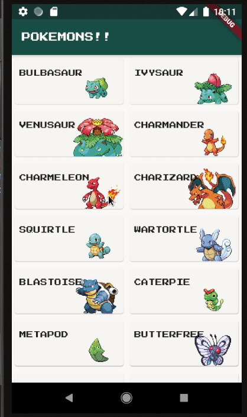

<h1 align="center">Pokemon color picker</h1>

> An toy app that demonstrates development of animations, theming and etc in flutter

> The main target is to change the main color of the theme based on colors of pokemon
> The pokemon are retrieved from a database with a infinite list coded and their selection is made with heroe animation

## ✨ Demo

## 📝 License

Copyright © 2020 [Elvis Nobrega](https://github.com/elvismdnin). 
This project is [MIT](https://github.com/elvismdnin/main_color/blob/master/LICENSE) licensed.
